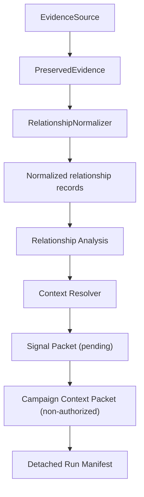

# Evidence Source Framework for Relationship Signals

## Scope

This framework separates source-owned evidence ingestion from Signal Agent's
relationship interpretation pipeline. It does not define a universal corpus
model. An `EvidenceSource` may represent any bounded source, but it can enter
`run_relationship_signal_pipeline` only when paired with a
`RelationshipNormalizer` that emits:

- `signal_agent.relationship_record.v1` records; and
- `signal_agent.unresolved_relationship_matches.v1` reporting.

Sources that do not produce relationships are outside this pipeline. This
milestone adds no additional importer, source registry, discovery mechanism,
network access, publishing, messaging, campaign authorization, or UI.

## Governed Flow



The runner invokes the boundaries in this order:

```text
prepared = source.prepare(...)
source.validate(prepared, ...)
preserved = source.preserve(prepared, run_root)
batch = normalizer.normalize(prepared, preserved)
analysis = analyzer.analyze(batch.records)
context = resolver.resolve(analysis)
signal_packet = packet_builder.build_signal_packet(...)
campaign_packet = packet_builder.build_campaign_context_packet(...)
manifest = manifest_builder.build(...)
```

Normalization must retain the exact supplied `PreservedEvidence` object. It may
not rediscover preservation state or depend on mutation left on an adapter
instance. Prepared values are opaque, immutable per-run values and may be used
by another equivalent adapter instance. Interleaved runs must remain isolated.

## Ownership

| Owner | Responsibilities |
|---|---|
| Evidence-source adapter | Source parsing, preparation, fail-closed local validation, preservation, concrete receipt construction/persistence, provenance, normalization, identifier protection, unresolved within-import candidates |
| Signal Agent analyzer | Interpretation, taxonomy matching, cluster inference, evidence, confidence |
| Context resolver | Explicit read-only search scope and contextual evidence |
| Packet builder | Pending signal and non-authorized campaign-context packets from prior outputs only |
| Manifest builder | Detached run identity and exact persisted-artifact hashes |
| Composition root | Select one source/normalizer and the concrete downstream implementations |

The complete source receipt remains adapter-owned. Downstream receives only a
frozen descriptor containing its ID, hash, source SHA-256, persisted relative
path, schema identity, and immutable non-secret protection metadata. The runner
may hash the persisted receipt bytes but does not parse adapter-specific fields.

LinkedIn remains the reference adapter. Its CSV rules, preamble/header handling,
physical-line provenance, date parsing, email HMAC, key-verifier lifecycle,
LinkedIn URL canonicalization, receipt body, and exact candidate detection stay
under `signal_agent/corpus_import/linkedin/`.

The adapter retains its existing atomic import-plan implementation internally:
parsing and record construction may occur while the opaque prepared value is
built, but no normalized batch is exposed until `normalize(prepared,
preserved)` receives the explicit preservation result.

## Deterministic Boundaries

- Source preservation remains byte-for-byte, SHA-256 verified, stat-stable, and
  no-replace.
- Relationship and unresolved-match schema versions are unchanged.
- Canonical JSON remains UTF-8, Unicode-preserving, sorted-key JSON with compact
  separators and exactly one final newline. JSONL remains one canonical object
  and newline per record.
- Artifact hashes cover exact persisted bytes, including final newlines.
- Packet hashes exclude only `packet_hash`; manifest hashes exclude only
  `manifest_hash`; neither canonical hash includes the persisted final newline.
- The source receipt is written by the adapter before normalization. The run
  manifest remains detached and is written last.
- Verifier lifecycle metadata and adapter instance identity do not enter record,
  packet, run, or artifact identities.

The source receipt currently records an absolute observed source path. That
pre-existing field makes its receipt hash and cryptographic dependents sensitive
to clone location. The compatibility witness materializes only that documented
path and its exact dependent hashes. Replacing it requires a future versioned
receipt migration and explicit compatibility rebaseline.

## Compatibility Witness

The exhaustive machine-readable witness is
`tests/fixtures/linkedin_connections/compatibility_witness_v1.json`. Its audit
capture used `E:\signal_agent`, the fixed `2026-08-02T12:00:00Z` clock, and key
ID `acceptance-test-key-v1`.

Stable reference identities:

```text
run                  lrr_5d059a99a05f43ee33a3
signal packet        rsp_96c4fee6dd9bae49cb5a
signal packet hash   sha256:ee1bd90e9b0235512c867388d0edf70f4fc49d3352c84106c536fcb8a6d5e416
campaign packet      ccp_e8e07cd1ddf0d2c176da
campaign packet hash sha256:cdd4dc2ee51ccdac5e09a06fda8d16a1015c04a34d65ef1d8e5cbccb7bdac101
manifest hash        sha256:f5fc2f95eaecc5264cc51778bf8c610d5ed2e8f76db2c9f4a842274f6bb512f4
```

Relationship record IDs:

```text
rel_fafdba32b6bfafde9379
rel_8d709a7563051c8163ab
rel_40e1a5ddf06cf6ced157
rel_7d7a651978d3f5844332
rel_3e18f37cc5e220cb65e7
rel_352c1be554abb08ce7d9
rel_d41c3f5e6eef5b1a8423
```

The witness itself is authoritative for all ten reference artifact byte sizes,
exact-byte hashes, media types, schema identities, and content templates.

## Dependency Graph

Before extraction:

```text
relationship_signals.pipeline
  -> corpus_import.linkedin
  -> relationship_signals.analysis
  -> relationship_signals.content_library
  -> relationship_signals.packets
  -> private manifest and artifact orchestration
```

After extraction:

```text
relationship_signals.pipeline  [LinkedIn composition root only]
  -> corpus_import.linkedin.adapter
  -> concrete analyzer / resolver / packet / manifest builders
  -> relationship_signals.relationship_pipeline

corpus_import.linkedin.adapter
  -> evidence_sources contracts and neutral models
  -> LinkedIn importer-owned implementation

relationship_signals.relationship_pipeline
  -> evidence_sources protocols, models, and canonical helpers
  -> injected interfaces only
```

Prohibited dependencies:

- Importers must not import relationship analysis, Context Library, packets,
  campaign modules, or manifest implementations.
- The generic relationship runner must not import a concrete adapter or concrete
  downstream implementation.
- Concrete downstream stages must not import a concrete source adapter.
- Only the LinkedIn composition root may import both sides.

## Extension Point

A future relationship-capable source supplies an immutable prepared value,
implements `EvidenceSource` and `RelationshipNormalizer`, persists its own source
receipt, and returns the neutral preservation and normalization models. It can
then be passed to `run_relationship_signal_pipeline` with the existing Signal
Agent components. Non-relationship sources require a different specialized
pipeline; they are not forced into this contract.
