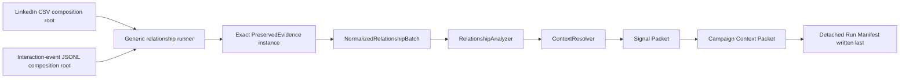

# Milestone 2 Repository Health and Second-Source Portability

## Status

Milestone 2 is implemented. Repository health was restored before portability
work began, and the offline `interaction_event_export.v1` source now traverses
the unchanged relationship pipeline programmatically. CLI exposure remains
deferred. The relationship-record schema, including its existing title, remains
byte-for-byte unchanged.



## Protected baseline

The dirty worktree was preserved without reset, checkout, clean, staging, or
commit. The restorable snapshot is under:

`E:\signal_agent\.tmp\milestone2-baseline-20260802T181500`

It contains the branch and HEAD identity, Git status, binary diff, protected
untracked files, intended-touch copies, and SHA-256 manifests. Before health
changes, the protected relationship matrix passed 106/106, the architecture and
witness subset passed 13/13, and the LinkedIn witness remained 10/10 exact.

## Repository-health restoration

The pre-portability health gate completed with zero collection errors and
2,694/2,694 tests passing in 23 minutes 12 seconds.

| Root cause | Implemented disposition | Focused evidence |
|---|---|---|
| Missing inspection facade | Added a typed lazy `shared.inspect.health_status` delegation to `shared.health.system_health_report` | Health-report tests and full collection |
| Windows Jinja path incompatibility | Passed UTF-8 string paths to all `TemplateStream.dump` calls | Book render and project-compile tests |
| Dependency drift | Declared exact `pypdf==6.7.0`, retained exact lock agreement, and added a dependency-contract test | Two independent clean reconstructions and PDF extraction |
| Stale operator interceptor | Accepted and forwarded `context_bundle` in the test interceptor | Variable-mapping tests |
| Missing authority setup | Built coherent promoted registry state in reaction tests and supplied the governed transition context required by routing policy | Reaction and authority suites |
| Live-generation activation boundary | Moved manual assembly behind `structured_generation.manual_activation.resolve_manual_generation_context` | Static policy and generation tests |
| Duplicate canonical registry record | Removed obsolete `reflective_pressure_spine` v0.1 and retained complete v0.2 | Invariant and reflective-pressure tests |
| Repository-global cache leakage | Redirected derivation cache policy and state to `tmp_path`; added explicit cache-hit coverage | Derivation/cache tests and full suite |
| WTPU isolation | Added backward-compatible keyword-only `agent` injection and passed the fake directly | WTPU test and full suite |

No failure was suppressed with a skip, xfail, weakened assertion, or disabled
governance check.

One implementation variance was required by the live contract. The approved
plan expected `shared/reactions.py` to remain unchanged, but coherent promoted
registry state alone still failed before registry authority was considered:
the governed `promoted -> routed` lifecycle rule requires both `bundle_path` and
`router_ruleset_hash`. The reaction runtime is the owner of that transition and
now supplies those values from the event and canonical router configuration.
Keeping the production path unchanged would have left live routing permanently
blocked or required the test to bypass the real authority gate.

## Dependency reproducibility acceptance

The pypdf repair is accepted from repository declarations, not from a manual
installation in the working virtual environment.

Tracked declarations:

- `pyproject.toml`: `pypdf==6.7.0`
- `environment/requirements.lock`: `pypdf==6.7.0`
- `tests/test_dependency_contract.py`: exact declaration agreement

The locked reconstruction initially exposed additional lock incompleteness:
Pydantic's required runtime packages were absent. Exact compatible Pydantic
runtime rows were added to the lock so that the independently locked environment
passes `pip check`; this was verified in the final reconstruction rather than
assumed from the working environment.

The final evidence root is:

`E:\signal_agent\.tmp\milestone2-evidence\health\pypdf-repro\success-20260802e`

Two new environments were created from the base Python executable:

1. `milestone2-pypdf-editable-20260802e`: installed only `-e .[dev]`.
2. `milestone2-pypdf-locked-20260802e`: installed the lock, then `-e .
   --no-deps`, then the declared test runner.

Both receipts record every command line, combined stdout/stderr, and exit code.
Both record Python and pip versions, pass `pip check`, report and freeze
`pypdf==6.7.0`, pass the metadata version assertion, and pass the embedded-text
PDF extraction test. Every recorded exit code is zero. Declaration SHA-256
hashes are captured in `declarations.txt`.

## Interaction-event source contract

The implemented source is an offline UTF-8 JSONL export with one event per
nonblank physical line. Required fields are `event_id`, `actor_id`, `thread_id`,
`timestamp`, and string `text`; `meta` may supply `display_name`, `company`, and
`position`.

Fatal validation includes missing or nonregular files, invalid UTF-8, malformed
JSON, non-object records, missing or invalid required fields, duplicate event
IDs, invalid metadata types, and timestamps without an explicit RFC 3339
offset. Blank text and missing metadata are nonfatal classified quality states.

The adapter:

- uses an external HMAC key of at least 32 bytes and rejects keys inside the
  repository;
- preserves the source byte-for-byte with an exclusive SHA-256 sidecar and
  deterministic source receipt;
- retains line counts, blank-line count, record count, UTC timestamp range,
  capture time, source identity, and protection metadata;
- preserves physical line order and emits one record per event;
- derives record IDs from source type, source SHA-256, event-ID hash, and exact
  raw-line hash;
- emits HMAC actor IDs and SHA-256 event/thread IDs without normalized clear
  source-local identifiers or clear event text;
- retains raw and canonical UTC timestamps, explicit parse state, line range,
  raw-line SHA-256, receipt ID, record number, and evidence reference on every
  record;
- leaves repeated actors as distinct events; and
- reports conflicting within-source actor metadata as unresolved review groups
  without selecting or merging a canonical identity.

The fixture contains six events across seven physical lines and covers offset
normalization, a blank line, repeated actors, blank text, missing metadata, and
conflicting metadata.

## Portability implementation

The additive implementation consists of:

- `signal_agent/corpus_import/interaction_events/key.py`
- `signal_agent/corpus_import/interaction_events/importer.py`
- `signal_agent/corpus_import/interaction_events/adapter.py`
- `signal_agent/relationship_signals/interaction_event_pipeline.py`
- `tests/fixtures/interaction_events/events.jsonl`
- `tests/fixtures/interaction_events/compatibility_witness_v1.json`
- four dedicated contract, slice, witness, and isolation test modules

`InteractionEventPreparedEvidence` is frozen. The adapter is stateless and
satisfies both neutral structural protocols. Prepared values can be validated,
preserved, and normalized by equivalent independent adapter instances.

The programmatic composition root injects the existing analyzer, context
resolver, packet builder, detached manifest builder, and generic runner. The
generic runner contains no concrete source import and no source-name branch.
The source package imports no downstream relationship implementation and does
not import the existing interaction controller.

## Portability evidence

The dedicated gate passes 20/20 tests and proves:

- all eight lifecycle/downstream stages complete;
- the completed tree contains exactly ten artifacts;
- the fixed witness matches all ten exact artifact byte sizes and SHA-256
  hashes;
- two independent fixed-clock runs are byte-identical;
- all six records validate against the unchanged relationship schema;
- every record carries physical-line and source-receipt provenance;
- protected actor IDs repeat without record merging;
- conflicting actor metadata remains unresolved;
- normalized artifacts contain no clear actor, event, or thread IDs and no
  clear event text;
- LinkedIn and interaction-event adapters can be interleaved without shared
  state; and
- an injected analyzer failure after preservation leaves the exact source,
  sidecar, and source receipt but creates no normalized output or completed run
  manifest.

Stable witness identities:

```text
run                  lrr_dc951576fe7afd377e33
signal packet        rsp_68d2977d4fb31a807ab9
campaign packet      ccp_d39fdb0ecd396100b312
signal packet hash   sha256:b10b002bbc587402cf3f75cd99c93e89a69ecb6c8fca8c6ced30adcd91d0aa05
campaign packet hash sha256:1c6e6fb4d0903016627632e4a36dde34e155a410e86a015f687176730ba25e73
manifest hash        sha256:93c662041a1094e78c11fc0b59d76c300fb05c427f9e2042c8c0b54c74e396de
```

## Scope decisions

CLI exposure is explicitly deferred. `signal_agent/corpus_import/cli.py` has no
interaction-event command or import, and CLI absence does not block the
portability proof.

The relationship schema is unchanged. Its SHA-256 remains
`32a6d191d16dee34f1b6ac563d87dbd8597072d731c99dd0260200819c0d1ee1`.
The existing relationship-schema title remains architectural debt. A title
change still requires an independent harmlessness proof, explicit review, and
acceptance.

No source registry, plugin discovery, cross-source identity matching, live API,
network behavior, messaging, publishing, campaign authorization, UI, or generic
workflow engine was added.

## Verification commands

```powershell
.\.venv\Scripts\python.exe -m pytest --collect-only -q
.\.venv\Scripts\python.exe -m pytest -q
.\.venv\Scripts\python.exe -m pytest -q tests/corpus_import tests/test_linkedin_relationship_governance.py tests/test_linkedin_relationship_slice.py tests/test_evidence_source_architecture.py tests/test_evidence_source_contracts.py tests/test_linkedin_compatibility_witness.py
.\.venv\Scripts\python.exe -m pytest -q tests/test_interaction_event_contract.py tests/test_interaction_event_relationship_slice.py tests/test_interaction_event_compatibility_witness.py tests/test_interaction_event_isolation.py
```

## Final verification closure

| Gate | Final result |
|---|---:|
| Full collection | 2,714 tests, 0 collection errors |
| Full pytest | 2,714 passed in 25m37s |
| Existing relationship/importer matrix | 106 passed |
| Architecture/contract/LinkedIn witness subset | 13 passed |
| Interaction-event contract/slice/witness/isolation | 20 passed |
| LinkedIn witness | 10/10 exact |
| Interaction-event witness | 10/10 exact |
| Generic-runner concrete source imports | 0 |
| Generic-runner source-name branches | 0 |
| pypdf clean reconstructions | 2/2 |

The final run used normal `pytest -q` without ignores, skips added by this
milestone, or environment-specific test selection.

## Rollback boundaries

Health repairs remain separable by root-cause group. The interaction-event
source, composition root, fixture, witness, and dedicated tests are additive and
can be removed as one portability unit without changing LinkedIn or the generic
runner. Optional future CLI work is a separate rollback unit.

Milestones 3 and 4 remain unapproved and must not begin without separate explicit
authorization.
