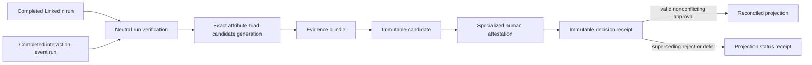

# Milestone 3: Cross-Source Identity Candidates and Governed Reconciliation

Status: implemented for the offline LinkedIn/interaction-event lane; verification evidence is recorded separately in `MILESTONE_3_IMPLEMENTATION_REPORT.md`.

Canonical base: `d953e46d53c32f6a75efb566f118cd26dc3e7c64`.

## Executive assessment

Milestone 3 adds a conservative, non-authoritative identity-reconciliation lane after two completed Milestone 2 source runs. Existing protected identifiers are deliberately not compared:

- LinkedIn protects canonical email values with `linkedin_email_identity_token.v1`.
- Interaction events protect opaque actor IDs with `interaction_event_actor_identity_token.v1`.
- The semantic inputs, namespaces, key identifiers, token versions, and verified key-material domains are not compatible.

Candidates therefore require one exact name representation plus exact organization and position. Candidate eligibility is Boolean and policy-bound; it is not a score or identity assertion. Every decision requires an explicit, specialized human attestation. Only an approved, nonconflicting candidate can produce a projection, and a later rejection or deferral changes effective state through an immutable status receipt.

The generic relationship runner, both source adapters, relationship schemas, source records, source receipts, source-run trees, CLIs, and both Milestone 2 witnesses remain unchanged.

## Architecture and trust boundary



Milestone 3 operates only on completed neutral records, detached manifests, source receipts, and its own governed artifacts. It never opens preserved source files. Source evidence is revalidated before an active projection is built. Reconciliation artifacts are written outside both source-run trees.

## Comparison policy

The tracked policy is `config/identity_reconciliation/linkedin_interaction_attribute_v1.json`, version `1.0.0`.

The only normalization rule is:

1. Unicode NFKC.
2. Trim leading and trailing whitespace.
3. Collapse internal whitespace.
4. Unicode case-fold.

Punctuation is retained. Tokens are not reordered. Initials, aliases, nicknames, phonetics, edit distance, fuzzy matching, behavior, interaction text, and timing are not comparison inputs.

A candidate is emitted only when the same LinkedIn record and at least one occurrence for one interaction actor reference have all of:

- exact normalized `display_name`, or exact LinkedIn `first_name + last_name` to interaction `display_name`;
- exact normalized organization;
- exact normalized position;
- nonempty values for all three signals.

Interaction occurrences are grouped only by an exact protected actor token inside one completed interaction-event run. The token is used to establish a source-local reference and is never serialized into Milestone 3 artifacts. Repeated LinkedIn rows are not grouped, so distinct source records remain distinct candidates.

The accepted fixtures produce five candidates:

- Avery Stone: `conflicting`, because the interaction actor has contradictory metadata.
- Jordan Lee at Atlas Knowledge Systems: `proposed`.
- Casey R. Morgan: `proposed` through `first_last_to_display_name_exact`.
- Two distinct Rowan Pine source rows: two distinct `proposed` candidates.

Taylor Reed, the metadata-less interaction actor, and Jordan Lee at Governed Works do not produce candidates.

## Evidence classes and prohibited inputs

Exact name, organization, and position are strong supporting evidence. Name alone, professional attributes without a name, and timestamps are insufficient. Missing required attributes block generation. Source-local metadata contradictions are conflict evidence and make a candidate approval-ineligible.

The following are prohibited:

- cross-domain HMAC equality;
- raw email, LinkedIn URL, actor ID, event ID, thread ID, or interaction text;
- profile-hash comparison to actor, event, or thread hashes;
- text or behavioral similarity;
- fuzzy, phonetic, alias, nickname, or probabilistic matching.

Artifacts contain references and outcomes, never compared attribute values, reversible value digests, clear identifiers, or protected token values.

## Artifact models

All primary models are immutable mappings persisted in canonical UTF-8 JSON and sealed with SHA-256 hashes over canonical content excluding only their own hash field.

### Identity evidence bundle

An evidence bundle binds:

- policy ID, version, and exact file hash;
- left and right source-local identity references;
- source type/hash, receipt ID/hash, run ID/manifest hash, normalized-artifact path/hash, record IDs, and evidence references;
- exact comparison outcomes and field paths without values;
- complete applicable conflict evidence;
- an explicit protected-token incompatibility result;
- prohibited-input and privacy declarations.

### Identity candidate

A candidate is immutable and has status `proposed` or `conflicting`. Its ID excludes the generation timestamp and derives from the policy hash, both source-run identities, both source-local identity-reference IDs, and the evidence-bundle identity. Every candidate declares:

- human review required;
- automatic merge not performed;
- projection not authorized;
- policy identity and evidence-bundle identity;
- conflict/missing counts and structured rationale codes.

### Decision receipt

`IdentityReviewAuthority` supports only:

- authority type `human_attestation`;
- role `identity_reconciliation_reviewer`;
- attestation version `identity_review_authority_attestation.v1`;
- nonempty reviewer, authority-basis, and offset-aware timestamp fields.

This is a local authority claim, not authentication, identity proof, or a cryptographic signature. Every receipt records those limitations.

The review state machine is:

```text
proposed    -> approved | rejected | deferred
conflicting -> rejected | deferred
approved    -> rejected | deferred
rejected    -> approved | deferred
deferred    -> approved | rejected
```

Candidate state is never mutated. Each decision occupies an exclusive path derived from candidate ID and predecessor decision ID. An exact byte replay is idempotent; a different successor from the same predecessor is rejected. Same-state decision spam and stale/forked predecessors fail closed.

### Reconciled projection and reversal

Only the current valid approval receipt for a nonconflicting candidate can create an active projection. The projection contains exactly two source-local member references and no canonical person representation. Its assertion scope is `authorized_reconciled_view_not_established_identity`.

A superseding rejection creates a `withdrawn` status receipt. A superseding deferral creates `review_required`. The original projection and decisions remain unchanged. A later approval creates a new projection revision in the same lineage. Projection construction requires source-run roots so all source hashes and evidence references can be revalidated immediately before use.

## Storage layout

Candidate generation:

```text
00_inputs/source_run_references.json
01_evidence/<evidence_bundle_id>.json
02_candidates/<candidate_id>.json
05_receipts/candidate_generation_manifest.json
```

Review and projections:

```text
03_review/<candidate_id>/from-<predecessor-or-root>.decision.json
04_projections/<projection_lineage_id>/<projection_id>.json
04_projections/<projection_lineage_id>/status/<status_receipt_id>.json
05_receipts/reconciliation_manifests/<manifest_id>.json
```

Candidate and projection operations stage or exclusively create artifacts. A detached reconciliation manifest is written last. Partial files are distinguishable from a completed run because no valid completed manifest exists after an injected failure.

## Public programmatic interfaces

- `generate_identity_candidates(...)`
- `record_identity_decision(...)`
- `build_reconciled_identity_projection(...)`
- `record_projection_status(...)`

Approval recording and projection construction additionally accept a required `source_run_roots` mapping as a keyword-only safety input. Reject and defer receipts remain possible without available source evidence so a reviewer can durably suspend or withdraw effective state. This keeps evidence revalidation enforceable rather than advisory without blocking conservative reversal.

There is no CLI, UI, network, live API, formal-governance adapter, source registry, automatic decision, automatic merge, or projection-member expansion.

## Failure and rollback behavior

- Invalid or changed manifests, receipts, normalized artifacts, record provenance, policy files, candidates, bundles, decisions, or projections fail closed.
- Candidate-generation failure creates no review decision and no completed generation manifest.
- A failed projection manifest write leaves an immutable partial projection distinguishable from completion and does not alter its candidate or decision.
- Reversal appends receipts and never deletes or edits history.
- Candidate generation, reviews, and projections are separately removable additive lanes; source-run artifacts are not rollback targets.

## Verification and Definition of Done

The focused suite covers:

- five exact fixture candidates and classifications;
- exact normalization boundaries and clock-independent candidate identities;
- deterministic ordering, bytes, manifests, and exact witness trees;
- source-tree byte identity and Milestone 2 protected hashes;
- complete conflict evidence and blocked conflicting approval;
- valid approve/reject/defer receipts and rejected invalid authority;
- replay idempotence, exclusive successors, invalid transitions, and history preservation;
- approval-only projections, evidence revalidation, withdrawal, and reapproval lineage;
- schema, hash, privacy, architecture, forbidden-import, CLI, and failure-state checks.

Milestone 3 is complete only when the inherited 190-test Milestone 2 closure gate, all Milestone 3 tests, both Milestone 2 witnesses, and the new Milestone 3 witness pass together with the protected-file and diff audits.

## Deferred work

The following require separate approval: shared comparison tokens, authenticated authority, live-source work, additional source types, canonical identity selection, global identity graphs, CLI/UI exposure, networking, workflow promotion, and all Milestone 4 behavior.
