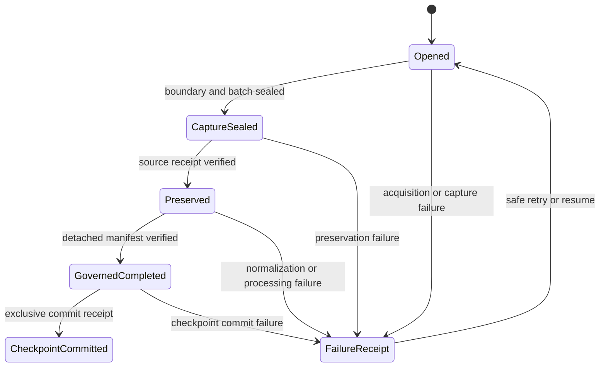

# Milestone 4: Operational Ingestion and Live-Source Architecture Plan

Status: planning only; no Milestone 4 implementation is authorized by this document.

Repository: `E:\signal_agent-milestone2-closure`

Branch: `codex/milestone3-closure`

Canonical base: `6c533cfe7b3c1b1a43c1c68cea98787b2b6441bc`

## 1. Executive assessment

Milestone 4 is feasible without changing the source-neutral relationship runner, either existing source adapter, any Milestone 1-3 schema, or any compatibility witness. The proposed M4A/M4B/M4C sequence is directionally correct, with one important refinement: M4C must have a source-specific offline-adapter gate before any live transport is activated.

The central invariant is correct and mandatory:

> A fetched cursor, next-page token, or remote high-water mark is not a committed checkpoint. Checkpoint advancement is permitted only after the exact captured batch has been preserved, the governed processing run has produced and verified its detached completed manifest, and a separate checkpoint-completion verifier has bound that manifest to the acquisition boundary.

Two determinism domains are mandatory and must not be conflated:

- **Transport-history determinism:** an identical acquisition script, response sequence, retry schedule, and injected clock produces byte-identical operational attempts, captures, and session artifacts.
- **Semantic-evidence determinism:** different approved page partitions or retry histories that represent the same canonical source observations produce the same `observation_set_hash`, bounded semantic material, normalized effects, and governed downstream outputs. Their attempt receipts, exact page captures, capture references, and `capture_set_hash` may legitimately differ and remain immutable provenance.

Exact capture identity and semantic observation identity are likewise separate. `capture_set_hash` seals the exact acquired page/capture provenance. `observation_set_hash` seals the canonical source observation descriptors independently of valid page partition and retry history. Exact capture references remain available through provenance artifacts, but an exact capture-set hash must not enter semantic bounded-material identity, normalized record identity, or downstream identity when that would make semantically equivalent acquisitions diverge.

Stable immutable IDs are byte-safe. If an artifact ID excludes creation time or other volatile operational metadata, exact replay must load, fully verify, and return the existing artifact. It must not recreate or overwrite the same ID with a new timestamp or different bytes. This rule applies to checkpoint candidates, commit receipts, content-addressed observation indexes, and every other immutable artifact whose identity excludes volatile fields.

Checkpoint receipts contain a bounded `observation_index_ref` and `observation_index_hash`, not an ever-growing inline observation history. The referenced observation-index artifact is immutable and content-addressed. M4A defines and verifies that boundary but introduces no compaction, pruning, mutable current-state file, or history rewrite.

The recommended design adds a small operational acquisition layer *above* the existing `EvidenceSource` lifecycle. The operational layer owns remote request intent, page acquisition, retries, rate-limit handling, exact successful-response capture, pagination continuity, bounded-batch assembly, and checkpoint transitions. It does not parse preserved source files into relationship records and does not enter the generic relationship runner. A source-specific bounded evidence adapter remains responsible for `prepare`, `validate`, `preserve`, and `normalize` exactly as in Milestones 1 and 2.

The recommended implementation sequence is:

1. **M4A — Operational contracts and kernel:** frozen models, schemas, capture and checkpoint persistence, secret-safe attempt receipts, state resolution, deterministic batch assembly contracts, and failure injection. No networking and no relationship-specific dependency.
2. **M4B — Offline simulated paginated source:** a deterministic, injected transport and a synthetic source-specific relationship adapter proving pagination, retry, duplicate handling, changes, explicit tombstones, interruption, resume, preservation, downstream processing, and checkpoint commit. No networking.
3. **M4C1 — Selected-source offline adapter:** a Gmail History metadata adapter exercised only against synthetic or reviewed captured response fixtures.
4. **M4C2 — Bounded live read activation:** separately approved authentication and read-only transport for one configured mailbox label, after M4A, M4B, M4C1, dependency reproducibility, privacy review, and secret-boundary gates pass.

M4A and M4B prove the architecture. M4C proves one real operational source, but live activation must not be used to discover or repair the architecture. At-least-once acquisition is the default. Deterministic deduplication is preferable to advancing a checkpoint across an uncertain gap.

No CLI, UI, scheduler, daemon, webhook, source registry, automatic reconciliation, or upstream write belongs in Milestone 4.

## 2. Verified current architecture

The canonical Milestone 3 closure is clean at the stated base SHA. The current architecture has these verified boundaries:

- `signal_agent.evidence_sources.contracts.EvidenceSource` accepts a bounded `Path`, prepares source-specific state, validates it, and preserves it as `PreservedEvidence`.
- `RelationshipNormalizer` converts the exact prepared/preserved pair into a neutral `NormalizedRelationshipBatch`.
- `signal_agent.relationship_signals.relationship_pipeline` calls only neutral protocols. It retains the exact `PreservedEvidence` instance and contains no LinkedIn or interaction-event source branch.
- A concrete source writes its source receipt during preservation. The detached governed manifest is written last, after normalized records and downstream artifacts.
- A post-preservation failure leaves preserved source evidence and its receipt but does not create a completed detached manifest.
- The LinkedIn and interaction-event composition roots inject source-specific adapters into the unchanged generic runner.
- Milestone 3 reads completed neutral source runs. It does not mutate source records and does not introduce an operational acquisition path.

The protected closure hashes remain the planning baseline:

| Protected path or artifact | SHA-256 |
|---|---|
| Generic relationship runner | `967df45db658ea28200a093385b82f85b98f265781c7232516890312cccdff44` |
| LinkedIn adapter | `44d001c43ebd374bfd4688fd9db5d0ef1d389bb41b1ba420c0111f65a392e01d` |
| Interaction-event adapter | `76954c789a92c313c297cfe8c4745b322e02453482f5573c7e20e6d7cb4d0589` |
| Relationship-record schema | `32a6d191d16dee34f1b6ac563d87dbd8597072d731c99dd0260200819c0d1ee1` |
| LinkedIn Milestone 2 witness | `00755207eb9dc889951e9c751a58bc4e359cdecfac7a843a032370056dd9ce02` |
| Interaction-event Milestone 2 witness | `823940b686bc7f0c0d6ccb5d348412ee7a39c2c15ea5ae2d457f62143146a14d` |
| Milestone 3 witness | `80a3790f8c88e5e5ed3a827c37052f9572c8a6783dbfaa3de79cc96567fe862b` |

The operational extension fits above the bounded-source contract:


`signal_agent/media_opportunities/gmail.py` is a plausible future-source clue, not a governed ingestion implementation. Its current reader uses the read-only Gmail scope and paginates message listings, but it eagerly materializes messages and full threads, discards page tokens after traversal, couples OAuth refresh/token-file writes to acquisition, and produces no captures, preservation receipts, checkpoints, or governed completion binding. It must not be retrofitted into the M4 kernel or treated as evidence that operational guarantees already exist.

## 3. Operational-ingestion problem definition

An **ingestion run** is one attempted transition from a specific previously committed source checkpoint to at most one successor checkpoint. It may contain several request attempts, several page captures, an interruption and resume, one sealed acquisition boundary, one deterministic bounded evidence materialization, one governed processing run, and zero or one checkpoint commit. A transport call, an acquisition session, and a governed source run are related but are not synonyms.

The required distinctions are:

| Term | Meaning | Completion claim |
|---|---|---|
| Remote observation | A transient response or transport outcome received from an upstream read request | None; it may still exist only in memory |
| Acquired page | A successful, schema-eligible response body durably captured byte-for-byte with an allowlisted, secret-free capture receipt | Proves what was observed for one request, not that the source interval is complete |
| Acquired batch | A sealed set of verified page captures plus a source-specific end-of-stream/observation-boundary claim | Proves the acquisition boundary and capture set, not downstream completion |
| Preserved evidence | Deterministic bounded source material preserved through a concrete `EvidenceSource` with its source receipt | Proves immutable local source evidence, not successful normalization or processing |
| Normalized evidence | Neutral records derived from the exact preserved material with record-level provenance | Proves source-specific transformation only |
| Completed governed run | All required downstream artifacts plus a valid detached manifest written last and reverified | Proves the approved governed processing contract for that exact preserved material |
| Committed checkpoint | An immutable successor receipt binding the prior checkpoint, acquisition boundary, preserved receipt, and completed manifest | Authorizes the next ingestion run to begin after the new boundary |

The problem is not merely pagination. It is preserving a causal chain in which remote acquisition is fallible and nondeterministic while local evidence processing remains deterministic for fixed captured bytes. The architecture must prevent these false claims:

- a page token implies complete coverage;
- a successfully captured page implies a successfully preserved batch;
- preserved bytes imply successful normalization or downstream processing;
- generated output files imply a completed governed run;
- an absent remote record implies deletion;
- a retry or page replay is a new source event;
- a local credential or rate-limit event is governed source evidence.

Milestone 4 guarantees no system-induced gap under the declared source contract. It cannot claim that a provider exposes history it does not expose. Provider retention limits, unavailable history, and ambiguous deletion semantics must become explicit failed/unsupported coverage outcomes rather than silently advanced checkpoints.

## 4. Proposed state machine

The proposed names in the brief are more granular than the causal contract needs. `normalized` and `processed` are internal runner stages; neither authorizes progress. Separate named failure states also risk becoming a mutable status matrix. The smallest persistent state model is derived from immutable artifact existence:

```text
opened
  -> capture_sealed
  -> preserved
  -> governed_completed
  -> checkpoint_committed
```

Meanings:

- `opened`: an immutable session descriptor exists. Zero or more attempt receipts and successful page captures may also exist.
- `capture_sealed`: one exclusive acquisition-boundary artifact and its deterministic bounded material jointly exist and verify as the complete sealed assembly evidence. M4A has no standalone assembly-receipt artifact.
- `preserved`: the source-specific preservation receipt exists and binds the bounded material.
- `governed_completed`: the detached source-run manifest exists, was written last, and revalidates its exact source receipt and artifacts.
- `checkpoint_committed`: an exclusive checkpoint commit receipt binds the prior checkpoint, acquisition boundary, preservation receipt, and completed manifest.

There is no mutable `current_state` file. State is resolved from the longest valid artifact chain. A failure produces an immutable failure receipt containing `failed_stage`, `error_class`, `retry_disposition`, and references to the last valid artifact. `partial_capture` is therefore an observable condition of an `opened` session, not a checkpoint state. `checkpoint_uncommitted` means either no completion candidate exists or a verified candidate has not acquired its exclusive successor slot; it is not a successful state.



The diagram's retry arrow denotes a new attempt/session referencing the last valid artifacts; it does not mutate the failure receipt.

## 5. Acquisition-session model

M4A should add frozen, canonical-JSON models. The operational coordinator writes them with staging plus exclusive promotion.

### `AcquisitionIntent`

- Schema version.
- Deterministic `acquisition_cycle_id` derived from source instance, acquisition-policy hash, requested observation boundary, and prior checkpoint hash.
- Nonsecret `source_instance_id`, derived from the provider/source type and a protected configured-scope identity.
- Adapter ID, semantic version, implementation identity, and supported response schema.
- Acquisition-policy and retry-policy IDs, versions, and hashes.
- Prior committed checkpoint ID/hash, or `root` for bootstrap.
- Requested lower/upper observation boundary and coverage semantics.
- Credential-profile reference hash and authentication mode, operational only; no account name or credential material.

### `AcquisitionSessionDescriptor`

- Unique `session_id` and deterministic cycle ID.
- Intent ID/hash and prior checkpoint reference.
- `started_at` using an injected offset-aware clock.
- Transport kind and simulator/live mode.
- Secret-handling and capture-policy identities.
- No mutable page counter, cursor, or state field.

Session IDs and request-attempt times are operational provenance and are excluded from source observation IDs, bounded-batch IDs, normalized record IDs, and downstream artifact identity.

### `RequestAttemptReceipt`

- Attempt ID, session ID, request identity hash, safe continuation-state hash, and attempt ordinal.
- Started/completed times.
- Outcome class: `success`, `retryable_failure`, `permanent_failure`, `rate_limited`, `malformed_response`, or `capture_failed`.
- Allowlisted HTTP/status family, provider error code, and request ID if demonstrably nonsecret.
- Retry-policy identity, requested delay, applied delay, and next disposition.
- `error_body_persisted: false` by default.
- Sanitization-policy identity and a flag showing whether a secret-bearing response was omitted.

### `PageCaptureReceipt`

- Content-addressed capture ID.
- Request identity and safe continuation-state hash.
- Exact successful response-body SHA-256, byte size, media type, response-schema identity, and restricted capture path.
- Allowlisted response metadata such as status, content type, ETag, provider request ID, and coarse rate-limit counters.
- Previous/next capture-chain references and source-declared end-of-stream outcome.
- Extracted source-record reference descriptors containing protected source-local identity tokens, canonical record-content hashes, and locators into the captured page.
- No authorization/request headers, cookies, credentials, secret query parameters, or unreviewed error body.

### `AcquisitionBoundary`

The boundary is sealed only after the coordinator validates page-chain continuity, detects no cursor cycle, verifies all captures, and receives a source-specific terminal response. It contains:

- Boundary ID/hash, source and adapter identities, prior checkpoint, and acquisition cycle.
- Ordered capture references, an exact `capture_set_hash`, and a distinct page-independent `observation_set_hash`.
- Declared coverage kind and lower/upper observation boundary.
- The remote continuation or high-water candidate in a source-specific, explicitly classified operational form.
- End-of-stream evidence and record/duplicate/change/tombstone counts.
- Assembly-policy identity and bounded source-material ID/hash/path.
- Creation time, excluded from content identities.

The boundary is *not* a checkpoint candidate. Naming it a checkpoint candidate before evidence completion would blur the invariant this milestone is intended to establish.

### `BoundedSourceMaterial`

This is a deterministic, finite file accepted by a concrete `EvidenceSource`. Its stable semantic identity derives from the source instance, source/assembly policy, and `observation_set_hash`, not from exact retry history, page partition, or `capture_set_hash`. It contains the canonical source observation descriptors and a stable record index. Exact successful page bodies, capture receipts, and source-specific record locators remain immutable acquisition provenance linked through the acquisition boundary and observation-index provenance references. Canonical record order is independent of page number. The source-specific assembler, not the operational kernel, determines record schema and normalization eligibility.

Before preservation, durable state may therefore include the intent, session descriptor, attempt receipts, exact eligible page captures, a sealed boundary, and bounded source material. These are operational acquisition evidence. They are not a completed governed source run and authorize no checkpoint progress.

## 6. Checkpoint model

Checkpointing uses three immutable concepts rather than one mutable file:

1. `AcquisitionBoundary`: created after complete capture and assembly; contains the uncommitted remote continuation candidate.
2. `OperationalCheckpointCandidate`: created only after preservation and detached-manifest verification; binds every completion dependency.
3. `OperationalCheckpointCommitReceipt`: exclusively creates the successor transition and is the only artifact treated as a committed checkpoint.

### `OperationalCheckpointCandidate`

| Field | Required content |
|---|---|
| Schema and identity | Schema version, candidate ID/hash, creation time |
| Source identity | Source type, protected source-instance ID, adapter ID/version/implementation hash |
| Policy identity | Acquisition, assembly, retry, secret-handling, and completion-policy IDs/versions/hashes |
| Prior state | Prior committed checkpoint ID/hash or `root` |
| Acquisition proof | Cycle ID, boundary ID/hash, exact `capture_set_hash`, semantic `observation_set_hash`, and bounded-material ID/hash |
| Continuation | Source-specific safe cursor/watermark/history value and its classification, or a protected operational reference when clear persistence is not approved |
| Observation boundary | Coverage kind and exact lower/upper boundary claim |
| Preservation proof | Preserved source SHA, source receipt ID/hash/path, and exact preserved-instance reference |
| Processing proof | Governed run ID, detached manifest ID/hash/path, manifest schema, and verification result |
| Observation index | Content-addressed observation-index ID/path/hash; no complete inline history |
| Status | Constant `eligible_uncommitted` |

Candidate IDs exclude local timestamps, retry counts, page ordinals, transport attempt IDs, and credential identity. They derive from the source instance, adapter/policy identities, prior checkpoint hash, acquisition-boundary hash, observation-index hash, preserved source/receipt hashes, and completed manifest hash. Candidate creation is byte-safe: if the derived path already exists, the implementation must load and fully verify its sealed hash, ID derivation, stable inputs, manifest binding, and schema, then return those existing bytes. It must never recreate or overwrite the same candidate ID with a new creation time.

### `OperationalCheckpointCommitAuthority`

Checkpoint advancement is a technical local-state transition, not a human identity decision and not an external action. Its specialized authority is a frozen verifier attestation:

- `authority_type: completed_manifest_verifier`.
- Supported verifier version.
- Completion-policy ID/version/hash.
- Candidate ID/hash.
- Verification time.
- Assertions that the source receipt, preserved SHA, manifest, artifact hashes, prior checkpoint, and boundary all agree.
- `external_action_authorized: false`.
- `upstream_write_authorized: false`.

This attestation does not authenticate a person or grant campaign, messaging, publishing, or reconciliation authority.

### `OperationalCheckpointCommitReceipt`

- Schema version, commit ID/hash, and committed time.
- Source instance and adapter identity.
- Prior checkpoint ID/hash and successor candidate ID/hash.
- Acquisition boundary and capture-set references.
- Preserved source and source-receipt references.
- Completed governed run and detached-manifest references.
- Exact continuation/observation boundary required for the next run.
- Content-addressed observation-index ID/path/hash.
- Verifier authority attestation.
- `status: committed`.

The exclusive transition slot is derived from `source_instance_id` and the prior checkpoint ID, using `root` for bootstrap. An exact replay loads and fully verifies the existing byte-identical commit before returning it; no new timestamp or bytes are generated. A different successor for the same prior checkpoint is rejected without mutation. Concurrent forks cannot both commit. The same load-verify-return rule applies to every stable immutable artifact identity that excludes volatile metadata.

A checkpoint may advance only if all of the following are true:

1. The acquisition boundary and every referenced capture verify.
2. The exact `capture_set_hash`, semantic `observation_set_hash`, bounded material hash, and the complete sealed AcquisitionBoundary + BoundedSourceMaterial assembly pair verify in their separate identity domains.
3. The concrete preservation receipt exists and revalidates the same bounded material.
4. The normalized and downstream artifacts named by the detached manifest verify.
5. The detached manifest is present, sealed, and recognized as the runner's last-write completion artifact.
6. The candidate binds the exact source receipt and manifest to the exact acquisition boundary.
7. The prior checkpoint is still current and its exclusive successor slot is empty or contains the exact replay.
8. The content-addressed observation-index artifact verifies and the candidate/commit reference its exact hash.
9. The checkpoint commit receipt is durably and exclusively promoted.

If a completed detached manifest does not exist, the answer is unconditionally **no**: no checkpoint candidate may be marked eligible and no checkpoint may commit.

## 7. Resume semantics

The default is at-least-once acquisition from the last committed checkpoint. Silent loss is less acceptable than duplicate transport, because duplicates can be deterministically removed while an advanced cursor can make an omitted observation unrecoverable.

Given committed checkpoint `N`, acquisition of `N+1` follows this recovery algorithm:

1. Resolve the latest valid artifact chain; never trust a mutable status flag.
2. If no valid acquisition boundary exists, treat any page captures as partial.
3. Reuse a partial capture chain only when every capture and link verifies, the source adapter declares its continuation cursor replayable, the cursor is persisted under an approved nonsecret classification, and reacquiring the next page cannot skip records. Otherwise reacquire from committed checkpoint `N`.
4. When reacquiring, retain prior attempt/capture receipts as history. Content-addressing makes exact page replay idempotent.
5. If a valid boundary and bounded material exist but preservation does not, retry preservation without networking.
6. If preservation exists but the governed manifest does not, rerun deterministic local processing from the exact preserved material in a fresh attempt root or through the source runner's approved exact-replay behavior. Do not reacquire.
7. If the completed manifest exists but checkpoint commit does not, reverify the candidate and retry the exclusive commit. Do not reacquire or rerun downstream work.
8. If the successor checkpoint already exists and is the exact candidate, return it as an idempotent replay. If it differs, fail with a checkpoint-conflict receipt.

An uncommitted page token is only a performance optimization for safe same-boundary resume. Losing it must cause replay from `N`, not inference that its page was processed. A source whose cursor cannot be safely persisted or replayed always restarts from `N` and relies on deterministic deduplication.

The source-specific coverage contract must define recovery for an expired committed cursor. Expiry is not an empty result. It produces a `checkpoint_expired` failure and requires an approved bounded bootstrap/full-resynchronization path that overlaps already committed history. The old checkpoint remains current until that recovery run completes and commits.

## 8. Idempotency model

Idempotency is defined separately for acquisition, evidence, processing, and checkpoint transition:

| Layer | Stable identity | Replay result |
|---|---|---|
| Acquisition cycle | Source instance + policy/query identity + prior checkpoint + requested boundary | Same logical cycle; attempts may differ operationally |
| Page capture | Request identity + exact successful body hash + response-schema identity | Same capture reference; a new attempt receipt may point to it |
| Source observation | Protected source-local record key + canonical record-content hash + source adapter version | One immutable observation/version regardless of page/retry |
| Bounded material | Source instance + sorted canonical observation/version descriptors + `observation_set_hash` + assembly policy | Byte-identical semantic material for equivalent observations despite approved page/retry differences; capture histories may differ |
| Preserved evidence | Concrete adapter's existing deterministic rules | Same source SHA/receipt under fixed approved inputs |
| Governed processing | Exact preserved evidence + fixed policies/clock/key inputs | Byte-identical governed artifact tree |
| Checkpoint candidate | Prior checkpoint + boundary + preservation + completed manifest | Same eligible candidate |
| Checkpoint commit | Prior transition slot + exact candidate | Existing receipt returned; divergent candidate rejected |

Local acquisition time, retry delay, transport attempt number, rate-limit headers, page ordinal, and session ID must not enter normalized record IDs or downstream run identity. They remain operational provenance.

Canonical record-content hashing uses a source-specific canonical representation of the parsed remote record. Exact page-body bytes are hashed separately. A provider changing only JSON member order or response whitespace creates a new transport capture but not a new normalized effect; a changed field value creates a new observation version.

## 9. Deduplication model

Three duplicate classes must not be conflated:

### Transport duplication

The same response can appear because a request was retried, a cursor was replayed, or unstable pagination repeated a page. Equality is based on request identity, response-schema identity, and exact body hash. All attempt receipts remain; the capture set references the content-addressed page once.

### Source record identity

The source-specific acquisition adapter extracts a stable source-local record key and protects it according to that source's privacy policy. Page position is never the key. The operational kernel sees only the protected key token, its protection descriptor, and record locator. A source without a stable key must define and review a deterministic composite key before admission.

### Normalized observation identity

The immutable observation/version identity is derived from source instance, protected source-local key, canonical content hash, record type, and source adapter version. The bounded-material assembler emits one entry for each exact `(source-local key, content hash)` pair and retains every capture locator that observed it. The source normalizer therefore produces one effect for an exact replay but preserves multiple provenance references.

If one page includes a record already present in another page or prior retry, it is a duplicate observation. If the stable key matches and the content hash differs, it is a changed observation and is retained under Section 10. If two records have different stable keys but identical content, they remain distinct source observations.

A content-addressed source observation-index artifact records protected source-local keys, their committed observation/version IDs, content hashes, and bounded capture-provenance references. It contains no clear source-local identifiers. A checkpoint includes only `observation_index_ref` and `observation_index_hash`; it does not inline the complete index. The artifact supports cross-run deduplication and change lineage but never deletes history. M4A defines creation, sealing, verification, and reference contracts only; compaction, pruning, and mutable current-state storage are deferred.

## 10. Changed-record semantics

The rule is:

```text
same protected source-local identity
+ different canonical record-content hash
= new immutable source observation/version
```

The new version contains:

- Its own observation ID and content hash.
- The protected source-local key and protection descriptor.
- All current capture and record locators.
- The provider's claimed modification time, if available, classified as remote metadata rather than trusted local time.
- `supersedes_observation_id` and prior content hash when the immediately prior committed source index establishes a unique predecessor.
- A change classification such as `created`, `content_changed`, `metadata_changed`, or source-specific event type.

The prior captured bytes, preserved batch, normalized record, receipt, and manifest remain immutable. No "current row" is overwritten. If two different contents for the same key occur inside one acquisition boundary, both versions are retained in deterministic remote-time/content-hash order. The source adapter must mark ordering ambiguous when provider timestamps are absent or tied; it must not invent a winner.

Wire-only response changes that leave the canonical record representation equal are transport changes, not new normalized versions. Source-specific canonicalization must be versioned and hashed in the acquisition policy so a later canonicalization change cannot silently reinterpret history.

## 11. Deletion/tombstone semantics

Absence from a page, batch, filtered query, or later snapshot never proves deletion. A deletion or tombstone may be emitted only when the source supplies one of these approved evidence classes:

1. An explicit immutable delete/tombstone event naming the stable source-local record.
2. A source endpoint with reviewed semantics that explicitly reports deletion, such as a change-history `messageDeleted` event.
3. A record-specific terminal response whose provider contract conclusively means deleted, not unauthorized, filtered, rate-limited, or transiently unavailable, and whose request identity is preserved.
4. A separately approved complete-snapshot reconciliation policy proving the exact enumeration boundary and requiring more than a single absence. That policy is not part of the first lane.

An explicit tombstone is a new observation/version referencing the prior observation. It does not delete or mutate prior evidence. Its fields include source-local protected key, deletion evidence class, provider event/history reference, acquisition capture reference, source event/remote modification time when supplied, and `supersedes_observation_id` when established.

Ambiguous `404`, authorization loss, retention expiry, filtered visibility, or missing page content becomes `unavailable` or `coverage_unknown`, not `deleted`. Such outcomes block a completeness claim and checkpoint advancement when the missing record or interval is required by the source contract.

## 12. Pagination model

Pagination is acquisition provenance, not canonical record identity.

- A request descriptor records a source-specific continuation state and request hash. Clear cursor values are retained only in restricted operational artifacts when explicitly classified as non-authentication, nonsecret state.
- Each page capture records its predecessor request, body hash, returned continuation-state hash, and terminal/nonterminal classification.
- Page ordinal is diagnostic only. It may affect exact transport provenance and `capture_set_hash`, but it is excluded from `observation_set_hash`, bounded semantic material identity, source observation IDs, normalized record IDs, and all downstream identity.
- The assembler sorts observation/version entries by protected source-local key, canonical content hash, and source-specific stable event ordering. The same logical records partitioned across different valid pages produce the same canonical observation set and normalized output.
- Every observation retains all capture IDs and in-page locators, so raw page provenance is not lost when page boundaries are removed from semantics.
- A repeated continuation state before terminal completion is a pagination cycle and fails closed.
- A repeated page body with a new cursor is recorded as transport duplication and continues only if the source contract permits it.
- An empty final page is valid only when the source response explicitly establishes end-of-stream. An empty nonfinal page is valid only when the provider contract permits it and supplies a new continuation; otherwise it is malformed.
- Maximum page count, response bytes, records, and acquisition duration are bounded by policy. Reaching a bound without a valid terminal response produces `bounded_incomplete`, never a committed checkpoint.

For unstable page boundaries, the source adapter must use a stable record key and a source-supported observation boundary. Overlap and replay are accepted. Skipping forward based solely on page number is prohibited.

## 13. Retry and rate-limit semantics

Retry behavior is operational and versioned by a `RetryPolicy` containing maximum attempts, retryable outcome classes, exponential-backoff parameters, jitter rule, maximum elapsed acquisition time, and provider-specific `Retry-After` handling. The deterministic test clock and jitter source make simulations exact; production wall-clock delays never enter evidence identity.

Each attempt produces a separate secret-safe receipt. Retryable outcomes include only explicitly configured transport failures, timeouts, selected `5xx` responses, and rate-limit responses such as `429`. Authentication failures, authorization failures, malformed successful bodies, pagination cycles, policy-limit exhaustion, and most `4xx` responses fail permanently unless the source contract explicitly classifies them otherwise.

Rate-limit metadata is allowlisted operational telemetry:

- limit family or resource name;
- remaining/used counts;
- reset time or safe `Retry-After` value;
- provider request ID;
- policy-selected delay.

It does not enter source record identity, semantic bounded-material identity, preservation receipt identity, normalized records, or downstream manifests. A retry may create a different attempt timeline and capture tree while yielding the same `observation_set_hash`, canonical evidence, and byte-identical downstream artifacts.

Error persistence is fail-closed. Raw error bodies and exception strings are not written by default because providers and libraries may echo tokens, URLs, message content, or headers. The sanitizer emits an allowlisted error class/code and `detail_omitted: true`. If source-specific review later permits a sanitized error field, that field and sanitizer version must be explicit and tested.

## 14. Authentication and secret boundary

Authentication is operational configuration. It is never source evidence and never part of downstream deterministic identity.

The following values are prohibited from all page-capture receipts, bounded materials, preservation receipts, normalized records, detached manifests, checkpoint candidates/commits, failure receipts, logs, and test witnesses:

- Access tokens and refresh tokens.
- API keys and client secrets.
- Session cookies and cookie headers.
- Authorization, proxy-authorization, or signed request headers.
- Secret query parameters or signed URLs.
- OAuth authorization codes and PKCE verifiers.
- Token-file contents or token cache paths that reveal user identity.
- Secret-bearing exception messages, response bodies, stack-local representations, or debug dumps.

An acquisition intent may contain only a nonsecret, protected `credential_profile_ref`, an authentication-mode enum, and a credential-generation/version label. These identify which operational configuration was used without making credential material or a mailbox/account identifier governed evidence. Credential lookup, refresh, rotation, revocation, file permissions, and storage remain outside the M4A/B kernel. M4C must inject an already-resolved credential provider through a narrow transport interface.

Request persistence uses an allowlist, not header redaction after the fact. The stored request identity is a canonical hash over method, provider endpoint ID, nonsecret scope identity, pagination semantics, and safe parameters; it is not a dump of the request URL or headers. Successful response bodies are eligible for exact capture only when the source response schema and secret scanner establish that authentication material cannot be present. A response containing a secret-like pagination token must use a source-specific protected operational continuation strategy or be rejected until such a strategy is approved.

The existing Gmail reader's token refresh and token-file write behavior must not be called from the M4 kernel. A future Gmail transport may reuse underlying Google client libraries, but credential lifecycle remains outside governed acquisition artifacts and must be dependency- and privacy-reviewed separately.

## 15. Preservation boundary

Preservation begins only after a complete acquisition boundary is sealed. The operational capture store may already contain immutable response bodies, but those captures prove observations, not a governed source run.

The source-specific assembler creates one finite `BoundedSourceMaterial` file. For the simulator and first live lane, the recommended representation is a canonical JSON envelope containing:

- Source/adapter/policy identities.
- An `observation_set_hash` and canonical observation index independent of approved page/retry differences.
- Provenance references to the acquisition boundary's exact `capture_set_hash` and capture artifacts; those references are not part of semantic bounded-material identity.
- Exact successful response bodies encoded losslessly or exact restricted capture references copied into the preserved bundle.
- Stable source-record locators.
- Protected source-local record keys and canonical content hashes.
- Source-declared observation boundary and end-of-stream evidence.
- No request credentials, secret headers, raw error bodies, or unapproved cursor values.

The concrete `EvidenceSource` then performs the existing lifecycle: prepare the bounded path, validate schema/hash/privacy rules, preserve it byte-for-byte under the governed run root, write its source receipt, and normalize from that exact preserved instance. The preservation receipt adds the acquisition boundary ID/hash, `observation_set_hash`, assembly-policy identity, record/version counts, source hash, capture-time range, protection metadata, and a provenance reference to the exact `capture_set_hash`. Capture provenance may differ while the semantic bounded source bytes remain equal. The receipt does not claim processing completion.

Remote metadata is partitioned as follows:

| Metadata | Operational attempt/capture | Preservation receipt | Normalized provenance/record | Checkpoint |
|---|---:|---:|---:|---:|
| Request attempt and retry count | Yes | No | No | No |
| Page cursor/token | Restricted, if approved | No | No | Safe terminal continuation only |
| Rate-limit and backoff | Yes | No | No | No |
| Exact response-body hash | Yes | Capture-set aggregate/ref | Record capture ref | Boundary ref |
| Provider request ID/ETag | Allowlisted | Optional aggregate/ref | Capture reference only | No |
| Stable source-local record identity | Protected token only | Counts/protection descriptor | Protected token and record provenance | Protected observation index |
| Source event time | Capture content | Range only | Raw/canonical/state | Optional coverage boundary |
| Remote modification time | Capture content | Range only | Raw/canonical/state | Source-specific high-water boundary |
| Acquisition time | Yes | Capture-time range | Provenance reference, not identity | Candidate creation context |
| Preservation time | No | Yes | Source receipt reference | Preservation reference |
| Processing time | No | No | Artifact metadata under fixed clock | Manifest/commit reference only |
| Credential identity/material | Protected profile ref/material never | No | No | No |

Time meanings remain distinct:

- **Source event time:** when the domain event claims to have occurred.
- **Remote modification time:** when the provider claims the remote record last changed.
- **Acquisition time:** when this process received/captured the response.
- **Preservation time:** when the finite batch was durably preserved and receipted.
- **Processing time:** when normalization/downstream artifacts were produced.

Local acquisition, preservation, and processing times never substitute for missing source event/modification time and do not enter observation content identity. A remote watermark may enter checkpoint coverage only under a reviewed source contract.

## 16. Relationship to the existing `EvidenceSource` lifecycle

The existing `EvidenceSource` contract remains correct for bounded immutable material and must not acquire remote pages. Its existing responsibilities remain:

- Source-specific parsing and prepared-state construction.
- Fail-closed validation.
- Exact local preservation and source receipt creation.
- Source-specific protection and provenance.
- Normalization into the existing neutral relationship model.
- Source-local quality and unresolved-conflict handling.

The new operational layer supplies capabilities that do not belong in `EvidenceSource`:

- Request construction from a prior checkpoint and observation boundary.
- Read-only transport invocation.
- Retry, backoff, rate-limit, and timeout policy.
- Exact successful-response capture and secret-safe failure receipts.
- Pagination-chain and end-of-stream validation.
- Partial-capture recovery.
- Deterministic bounded-material assembly.
- Completion verification and checkpoint commit.

The minimal source-neutral operational protocols should resemble:

```python
class OperationalTransport(Protocol):
    def fetch(self, request: OperationalRequest) -> RemoteObservation: ...

class RemotePageSource(Protocol):
    def initial_request(self, intent: AcquisitionIntent) -> OperationalRequest: ...
    def assess_capture(self, capture: PageCapture) -> AcquiredPage: ...
    def next_request(self, page: AcquiredPage) -> OperationalRequest | None: ...
    def assemble(
        self,
        pages: Sequence[AcquiredPage],
        destination: Path,
    ) -> BoundedSourceMaterial: ...

class GovernedBatchProcessor(Protocol):
    def process(self, source: Path, run_root: Path) -> CompletedRunReference: ...
```

The protocols are illustrative; exact names require M4A review. `RemotePageSource` owns provider semantics while the operational coordinator owns state transitions. `GovernedBatchProcessor` is an injected completion boundary so the operational kernel does not import relationship code. A relationship composition root implements it by calling the existing source-specific `EvidenceSource`, normalizer, and generic runner. A future non-relationship composition root can inject a different specialized processor without changing acquisition contracts.

The generic relationship runner must remain byte-identical. Existing LinkedIn and interaction-event adapters must import no operational-ingestion code. M4 adapters may use the existing `EvidenceSource` protocol, but operational acquisition must terminate in a finite path before `prepare` is called. Any need to add a remote cursor, request client, retry branch, source token, checkpoint branch, or network error to the generic runner is an architecture stop condition.

This division permits reuse without a universal evidence framework: the shared operational kernel knows captures, bounded materials, failure receipts, and checkpoint causality; it does not define a universal normalized record, source registry, workflow engine, or cross-domain downstream pipeline.

## 17. Offline simulator design

M4B uses an injected `SimulatedOperationalTransport` and a source-specific `SimulatedRemoteInteractionSource`. The simulator must execute the real M4A coordinator, persistence, assembly, completion verification, and checkpoint commit code. It must not monkeypatch a network library or bypass capture persistence.

The smallest base fixture capable of proving the contract has three successful pages, four stable source-local record identities, and six record occurrences:

| Page | Records | Continuation | Additional behavior |
|---|---|---|---|
| `P1` | `R1/v1`, `R2/v1` | `cursor-1` | Successful bootstrap page |
| `P2` | replayed `R2/v1`, `R3/v1` | `cursor-2` | First attempt returns a deterministic `429`; retry succeeds |
| `P3` | changed `R2/v2`, explicit tombstone for `R3` | End of stream | Proves version lineage and deletion evidence |

`R4/v1` is used by an alternate page-boundary script that partitions the same canonical observation set differently; it may replace a duplicate occurrence in that variant so the base fixture remains small. The expected canonical observations are one `R1/v1`, one `R2/v1`, one `R2/v2` linked to its predecessor, one `R3/v1`, one explicit `R3/tombstone`, and one `R4/v1` when the boundary-variation scenario is selected. Exact replay of `R2/v1` produces no duplicate normalized effect but retains both capture locators.

The fixture contains deterministic:

- Safe cursors and request identities.
- Response bytes and allowlisted headers.
- Source event and remote modification timestamps distinct from acquisition time.
- Stable source-local keys and record-content hashes.
- Retryable `429`, permanent `403`, malformed `200`, and transport-interruption scripts.
- Repeated-cursor, cursor-cycle, empty-nonfinal-page, empty-final-page, and maximum-page-limit variants.
- Stable and unstable page partitions yielding the same canonical observation set.
- Failure-injection hooks after capture write, boundary seal, preservation, normalization, downstream output, manifest promotion, candidate creation, and checkpoint commit.

The simulator uses an injected virtual clock and records requested/applied backoff without sleeping. An interruption after `P1` or `P2` is restarted both ways: safe reuse of a verified replayable capture chain, and full reacquisition from the prior committed checkpoint. When those histories represent the same canonical source observations, they must yield the same `observation_set_hash`, bounded semantic material, normalized effects, and downstream artifacts. Their attempt receipts, page captures, and `capture_set_hash` may differ. The permanent-failure variant must leave the prior checkpoint current.

The source-specific M4B adapter should normalize synthetic interaction observations into the existing relationship-record schema without modifying that schema. It is additive and deliberately named for the simulator; it is not presented as a universal remote-event adapter. Its clear fixture identifiers remain confined to preserved bounded material, with protected identifiers and capture provenance in normalized records.

## 18. Candidate live-source comparison

The repository contains one existing read-only network source, Gmail, and one unrelated YouTube publisher. The publisher is a write path and is disqualified. A public GitHub repository interaction stream is the other plausible relationship-domain candidate; no governed GitHub client currently exists in the repository.

| Dimension | Gmail mailbox history for one label | Public GitHub repository issue comments |
|---|---|---|
| Read-only capability | Gmail History supports `gmail.metadata` or `gmail.readonly`; a metadata-only lane can avoid message bodies | Public issue-comment listing can be called without authentication; authenticated use can remain read-only |
| Authentication complexity | High: OAuth consent, credential refresh, token rotation, account scoping | Low for public resources; optional token increases limits but is not required for the first proof |
| Pagination semantics | `nextPageToken` within `history.list`; terminal response supplies a current `historyId` distinct from the page token | Page number and `Link` response header; page partition can move while comments are edited/created |
| Incremental checkpoint semantics | Strong: increasing, non-contiguous history IDs; expired IDs return `404` and require full synchronization | Moderate/weak: `since` filters by update time, but no durable change-feed cursor or snapshot-completeness claim |
| Stable source-local identifiers | Immutable message ID, thread ID, and history record ID | Stable comment ID/node ID, issue reference, and actor identifiers |
| Update timestamps | Message `historyId`/`internalDate`; history record order | Comment `created_at` and `updated_at` |
| Deletion semantics | Explicit `messagesDeleted` history events | Listing absence is ambiguous; the repository-wide list does not provide an equivalent complete deletion feed |
| Rate limits | Provider quotas and OAuth-specific limits; retry policy required | Explicit REST rate-limit headers and secondary-limit behavior |
| Fixture reproducibility | Synthetic metadata/history fixtures only; personal live data must never be committed | Public response fixtures are easier to review, but bodies/user data still require privacy handling |
| Privacy risk | High even in metadata; bodies, snippets, addresses, and headers are sensitive | Medium; comments and usernames are public but still personal/source content |
| Relationship relevance | High: people, messages, threads, and direct interaction chronology | Medium-high: actors interacting in repository discussions, but professional context is usually missing |
| Repository fit | Existing `GoogleGmailReadonlySource` and Google packages in the environment lock, but no governed history/checkpoint path | No existing client; earlier architecture planning correctly deferred authentication/pagination/networking to M4 |

Current provider facts used in this assessment are documented by the official APIs:

- Gmail `users.history.list` returns chronological history records, a `nextPageToken`, and a current `historyId`; history IDs are non-contiguous, and an invalid or expired `startHistoryId` typically returns `404`. It reports explicit message additions/deletions and label changes. See [Gmail users.history.list](https://developers.google.com/workspace/gmail/api/reference/rest/v1/users.history/list) and [Gmail synchronization guidance](https://developers.google.com/workspace/gmail/api/guides/sync).
- Gmail message resources describe the message ID as immutable and distinguish `internalDate` from message-header time. See [Gmail message resources](https://developers.google.com/workspace/gmail/api/reference/rest/v1/users.messages).
- GitHub's repository issue-comment endpoint supports public unauthenticated reads, stable comment objects, `sort=updated`, `direction`, `since`, `per_page`, and `page`. See [GitHub issue-comment endpoints](https://docs.github.com/en/rest/issues/comments).
- GitHub REST pagination uses `Link` headers, and rate-limit state is exposed through response headers. See [GitHub REST pagination](https://docs.github.com/en/rest/using-the-rest-api/using-pagination-in-the-rest-api) and [GitHub REST rate limits](https://docs.github.com/en/rest/using-the-rest-api/rate-limits-for-the-rest-api).

GitHub is the easier privacy/authentication exercise, but it is the weaker checkpoint-completeness exercise. Its comment listing does not give the same explicit durable change history or deletion signal. A periodic overlapping scan could reduce risk, but it could not honestly claim complete incremental coverage without a separately proven reconciliation policy.

## 19. Recommended first live adapter

After M4A and M4B, the recommended first live adapter is a **bounded Gmail History metadata lane for one explicitly configured label**, not the existing full-message/thread reader.

The recommendation is architectural, not an authorization to implement or connect it. Gmail is selected because its provider model directly exercises the most important Milestone 4 distinction:

- `nextPageToken` advances page acquisition but never becomes the committed checkpoint.
- The terminal `historyId` is the source continuation candidate.
- That history ID commits only after all pages, required message metadata lookups, bounded-material preservation, normalization, downstream processing, and detached-manifest verification succeed.
- Explicit `messagesDeleted` events support honest tombstone observations.
- An expired `startHistoryId` produces a fail-closed recovery condition instead of an empty-success interpretation.

The first lane is deliberately narrow:

- One configured account profile reference and one label ID.
- Metadata/history only: immutable message ID, thread ID, history event kind/ID, label IDs required by the contract, allowlisted sender/display headers if approved, and message/internal event times.
- No body, snippet, attachment, full thread, search query, draft, send, modify, label mutation, watch, Pub/Sub, or webhook behavior.
- Least-privilege `gmail.metadata` scope if M4C1 verifies that every required read is supported; otherwise `gmail.readonly` requires explicit privacy acceptance before M4C2.
- Bounded bootstrap for the configured label, followed by `history.list` partial reads.
- A `404` from an expired history checkpoint blocks advancement and invokes a separately tested bounded bootstrap path with deterministic overlap/deduplication.
- Clear email addresses and provider IDs remain confined to preserved source evidence and are protected before normalized use.

M4C1 must implement the page parser, response schemas, bounded assembler, finite `EvidenceSource`, and normalizer entirely against synthetic or reviewed captured fixtures. M4C2 may add an injected read-only transport only after secret scanning, dependency reproducibility, filesystem-permission, rate-limit, and live-data retention reviews. The current `GoogleGmailReadonlySource` remains unchanged and is not imported by the new adapter because its full-body/thread behavior and credential lifecycle are outside this lane.

GitHub issue comments remain the preferred second live-source candidate if a later milestone needs a lower-privacy public source. Before admission, it needs an honest observation-coverage policy that does not equate timestamp overlap or page completion with a durable upstream change feed.

## 20. Artifact and storage layout

Operational artifacts live outside governed source-run trees. A source run references the bounded material; neither the operational layer nor checkpoint store writes into an already completed governed run.

```text
operational_ingestion/
  <source_instance_id>/
    sessions/
      <session_id>/
        00_intent/
          acquisition_intent.json
          session_descriptor.json
        01_attempts/
          <attempt_id>.attempt.json
        02_captures/
          <capture_id>.body
          <capture_id>.capture.json
        03_boundary/
          acquisition_boundary.json
        04_batch/
          <bounded_material_id>.source.json
          <bounded_material_id>.assembly_receipt.json
        05_failures/
          <failure_id>.failure.json
    checkpoint_candidates/
      <candidate_id>.checkpoint-candidate.json
    observation_indexes/
      <observation_index_id>.observation-index.json
    checkpoints/
      from-<prior-checkpoint-or-root>/
        <checkpoint_id>.checkpoint-commit.json

governed_relationship_runs/
  <run_id>/
    source/
    normalized/
    analysis/
    packets/
    manifest/
```

Storage rules:

- All JSON is canonical UTF-8 with sealed SHA-256 fields using the repository's existing canonicalization conventions where compatible.
- Captures and bounded material are written to source/session-specific staging paths and promoted exclusively after verification.
- A boundary file is written only after all required captures and the bounded material verify.
- A detached governed manifest remains the last artifact in the source-run tree.
- A checkpoint candidate is written only after detached-manifest verification.
- A content-addressed observation index is written once and referenced by candidate and commit; it is never inlined into the checkpoint receipt.
- The checkpoint commit receipt is the final artifact of the checkpoint transition and uses an exclusive predecessor slot.
- Partial staging directories are identifiable and never interpreted as complete.
- Failure receipts are additive and never occupy completion paths.
- Raw successful response bodies are restricted source data even when public. They are never logs.
- Ignored test/live evidence directories are required for M4C verification; no credential, token, personal live response, or reproduction receipt is committed.

## 21. Dependency rules

The dependency direction is:

```text
operational_ingestion core
  <- source-specific remote acquisition adapter
  <- source-specific bounded EvidenceSource/normalizer
  <- source-specific composition root
  -> injected governed processor
```

Rules:

- M4A uses the Python standard library and existing canonical JSON/hash primitives only. It imports no relationship, identity-reconciliation, Gmail, GitHub, campaign, messaging, publishing, UI, or networking package.
- M4B imports no networking package. The simulator implements the same transport protocol in memory/from fixtures.
- The M4B synthetic source package imports the operational protocols and existing neutral evidence-source/relationship contracts, never a concrete LinkedIn or interaction-event adapter.
- The generic relationship runner imports no operational source, provider token, checkpoint type, or transport error.
- Existing LinkedIn and interaction-event adapters import no operational-ingestion or M4 source code.
- M4C's Gmail page adapter owns Gmail response semantics. Its composition root may import the operational coordinator and the existing generic runner, but neither imports it back.
- The existing media-opportunities Gmail reader remains independent; no M4 path imports it.
- No dynamic source registry, plugin discovery, universal source loader, CLI command, or background service is added.
- Future non-relationship processors depend on operational contracts only and supply a different bounded processor at composition time.

Google client packages are present in `environment/requirements.lock` but are not an accepted M4C dependency contract merely because they exist in one environment. Before M4C2, exact required packages must be declared consistently in `pyproject.toml` and the lock, tested by a dependency-contract test, and reproduced in clean editable and locked environments. M4A/B must not require those packages.

If M4C chooses a new transport dependency rather than the existing Google libraries, it requires separate review, an exact supported version, clean-environment receipts, `pip check`, and offline fixture tests. No dependency alignment is accepted based on a manual local installation.

## 22. Failure semantics

Every failure leaves the prior committed checkpoint current. The last valid immutable artifacts remain available for inspection and safe retry.

| Failure point | Durable evidence allowed | Forbidden completion claim | Resume action |
|---|---|---|---|
| Before first request/page | Intent, session descriptor, sanitized attempt/failure receipt | Boundary, preserved receipt, manifest, checkpoint | Retry under policy or begin a new session from prior checkpoint |
| Transport failure before capture | Sanitized attempt receipt | Page capture or coverage | Retry same request; no cursor change |
| Successful response but capture write fails | Attempt classified `capture_failed`; no claim that body is durable | Page capture, boundary, checkpoint | Reissue same request from last durable continuation |
| Malformed or secret-bearing response | Sanitized failure; raw body omitted unless reviewed safe quarantine is approved | Eligible capture, boundary | Permanent fail or retry only under explicit source policy |
| Between pages/interruption | Verified captures and attempt receipts | Sealed boundary, preservation, checkpoint | Reuse chain only under safe replay contract; otherwise reacquire from prior committed checkpoint |
| Repeated cursor/pagination cycle | Captures up to cycle and failure receipt | Boundary/end-of-stream | Fail permanently; source policy or fixture must be corrected |
| Policy bound reached before terminal page | Captures and `bounded_incomplete` failure | Complete coverage/boundary | Start an explicitly larger approved run or narrower source scope |
| Batch assembly failure | Verified captures and failure receipt | Boundary/preserved receipt | Repair source-specific assembly and rebuild deterministically from captures |
| Preservation failure | Sealed boundary, bounded material, failure receipt; partial preservation staging identifiable | Source receipt, completed manifest, checkpoint | Retry preservation from bounded material without networking |
| Normalization failure | Preserved source and receipt, failure receipt | Completed manifest/checkpoint | Retry local processing from exact preserved source |
| Downstream processing failure | Preserved source/receipt and partial downstream staging | Completed manifest/checkpoint | Retry local processing; source acquisition is not repeated |
| Output generated, manifest promotion fails | Partial outputs and failure receipt | Governed completion/checkpoint | Verify/remove only disposable staging per approved recovery; rerun from preserved source |
| Manifest exists but fails hash/reference verification | Invalid run retained/quarantined for audit | Checkpoint candidate/commit | Fail closed; rerun into a new governed attempt root |
| Checkpoint-candidate write fails | Verified completed governed run | Committed checkpoint | Recreate exact candidate from verified artifacts |
| Checkpoint commit write fails | Completed manifest and eligible candidate | Advanced current checkpoint | Retry exact exclusive commit; no acquisition rerun |
| Competing successor already committed | Losing candidate and conflict receipt | Forked current state | Exact replay returns winner; divergent successor requires explicit conflict review |
| Committed continuation expired upstream | Prior checkpoint plus provider `checkpoint_expired` receipt | Empty successful delta/new checkpoint | Execute approved bounded bootstrap; do not skip interval |

A failure receipt may be written after any stage, but it never substitutes for a boundary, preservation receipt, detached manifest, candidate, or commit. Cleanup must be limited to disposable staging created by the failed attempt; captured evidence, receipts, manifests, candidates, and commits are immutable.

## 23. Test and witness strategy

### M4A contract and kernel tests

- Frozen model and canonical-hash validation for intent, session, attempt, capture, boundary, candidate, verifier authority, and commit receipt.
- Exclusive-write, exact-replay idempotence, and divergent-successor rejection.
- State resolution from artifact chains; no mutable status trust.
- Secret allowlist/redaction tests including tokens in headers, query parameters, URLs, exception messages, and error bodies.
- Cursor classification and refusal of unapproved secret-like continuation state.
- Page/capture hash verification, predecessor-chain verification, repeated-cursor/cycle detection, terminal-response validation, and configured bounds.
- Checkpoint candidate refusal without preservation receipt, completed detached manifest, exact source hash, or matching boundary.
- Checkpoint commit refusal without supported verifier authority or when the prior checkpoint is stale.
- Failure injection at every persistence boundary.

### M4B simulator tests

- First successful acquisition and root checkpoint.
- Multi-page acquisition and explicit final page.
- Duplicate response/page replay and duplicate remote records across pages.
- Retryable `429`, deterministic backoff receipt, and eventual success.
- Permanent failure with no checkpoint advancement.
- Interrupted acquisition after page one and page two.
- Safe resume from verified replayable partial capture.
- Forced reacquisition from the prior committed checkpoint with byte-identical bounded material.
- Stable and unstable page boundaries producing the same observation set and downstream artifacts.
- Changed stable source-local record producing a new linked observation/version.
- Explicit tombstone and ambiguous absence behavior.
- Preservation, normalization, downstream, output-before-manifest, manifest, candidate, and commit failures.
- Malformed response, secret-bearing response, empty page, nonfinal empty page, final empty page, repeated cursor, cycle, and policy-bound exhaustion.
- Source-run isolation and no writes into source capture history.
- Exactly one normalized effect for exact record replay.
- Exact preserved-instance retention through the existing generic runner.

### M4C offline and live gates

- Synthetic Gmail bootstrap and history pages, including `nextPageToken`, terminal `historyId`, duplicate message references, additions, labels, explicit deletions, and expired-history `404`.
- Metadata-only response enforcement and body/snippet/attachment rejection.
- One-label source-scope enforcement.
- No import or call to the existing full-body Gmail reader.
- Credential-provider isolation and zero token/header/query leakage.
- Recorded-response deterministic tests with no committed personal data.
- Opt-in bounded live smoke only after explicit M4C2 approval; deterministic acceptance remains fixture-based and cannot depend on network availability.

### Compatibility and architecture gates

- Re-run the Milestone 3 closure scoped gate: 216 passed with the one documented invariant deselection.
- Re-run all three existing witness tests; never regenerate their fixtures.
- Assert the protected generic-runner, LinkedIn adapter, interaction-event adapter, relationship schema, and three witness hashes remain exact.
- Static scans for networking imports in M4A/B, provider/source tokens in the generic runner, M4 imports in existing adapters, upstream write verbs, CLI/UI/scheduler/daemon paths, automatic reconciliation calls, and preserved-source mutation.
- Scan every M4 artifact, receipt, log fixture, and witness for prohibited credential patterns and fixture secrets.

### New witness

M4B adds one exact fixed-clock witness that seals:

- Root acquisition intent/session.
- Three-page capture with one retry.
- Duplicate record deduplication and changed-record lineage.
- Explicit tombstone.
- Bounded material and preservation receipt.
- Complete downstream governed tree.
- Eligible checkpoint candidate and committed root checkpoint.
- An interrupted replay from that checkpoint that proves no advancement until completion.
- Semantic equality between independent runs with different approved retry timelines/page partitions but the same canonical observations: identical `observation_set_hash`, bounded semantic material, normalized effects, and downstream outputs. Their immutable transport trees and `capture_set_hash` values may differ.

The witness must also include a negative assertion that a failure after output generation but before manifest completion yields zero committed checkpoints. M4C uses synthetic source-specific fixtures and may add a separate reviewed witness, but no live personal response is committed.

The decisive invariant test constructs every pre-manifest artifact, attempts checkpoint advancement, and requires failure. It then writes/verifies the detached manifest, retries the same candidate, and requires exactly one commit.

## 24. KPI scorecard

| KPI | Baseline | Target | Evidence | Stop threshold |
|---|---:|---:|---|---:|
| Silent system-induced data gaps under declared source contract | Not measured | 0 | Interruption/replay/expiry scenarios and boundary proofs | Any gap or unproved coverage claim |
| Checkpoints committed without completed governed manifest | 0 known | 0 | Candidate/commit negative tests and artifact scans | Any commit |
| Secrets in governed or operational persisted artifacts | Not measured | 0 | Pattern/canary scans across captures, receipts, logs, manifests, checkpoints, witnesses | Any secret |
| Duplicate normalized effects from exact replay | Not measured | 0 | Page/retry/session replay assertions | Any duplicate effect |
| Lost observations after resumable failure | Not measured | 0 | Partial reuse and reacquisition tree comparisons | Any loss |
| Source-history mutations | 0 | 0 | Before/after capture/source-run hashes | Any mutation |
| Deterministic downstream output for fixed captured evidence | N/A | 100% | Two independent fixed-input tree comparisons | Any byte drift |
| Exact change lineage for changed stable IDs | N/A | 100% | Observation-index and supersession assertions | Any unlinked overwrite |
| Absence interpreted as deletion | 0 | 0 | Tombstone policy tests | Any inferred deletion |
| Capture/batch provenance coverage | N/A | 100% | Every normalized record resolves to receipt, capture, and locator | Below 100% |
| Checkpoint-to-batch-to-manifest traceability | N/A | 100% | Commit-chain verification | Any missing link |
| Milestone 1-3 witness drift | 0 | 0 | Three existing witness tests and protected hashes | Any drift |
| Generic-runner changes | 0 | 0 unless separately authorized | SHA-256 and static test | Any unreviewed change |
| Existing adapter/schema changes | 0 | 0 | Protected hashes/diff audit | Any change |
| Live writes to upstream sources | 0 | 0 | Transport method allowlist and static/runtime tests | Any write verb |
| Live-source scope | 0 | Exactly one bounded M4C source | Diff/import/config audit | Additional source or scope |
| Unexplained test failures | 0 | 0 | Closure plus M4 gates | Any unexplained failure |
| Out-of-scope feature additions | 0 | 0 | Diff and import audit | Any addition |

Provider-caused retention loss or unavailable history is not relabeled as a successful zero-gap run. It is counted as an explicit incomplete/expired coverage failure, leaves the checkpoint unchanged, and must be reported separately.

## 25. File-by-file expected change map

Only this planning report is created during the current planning phase. The following paths are proposed for later implementation and require explicit approval.

| Phase | Expected additive path | Purpose |
|---|---|---|
| Planning | `docs/architecture/MILESTONE_4_OPERATIONAL_INGESTION_AND_LIVE_SOURCE_PLAN.md` | Canonical reviewed plan |
| M4A | `config/operational_ingestion/retry_policy_v1.json` | Versioned retry/backoff defaults for simulator; live overrides remain source-specific |
| M4A | `schemas/operational_ingestion/acquisition_intent.v1.schema.json` | Intent and source-scope contract |
| M4A | `schemas/operational_ingestion/acquisition_session.v1.schema.json` | Immutable session descriptor |
| M4A | `schemas/operational_ingestion/request_attempt_receipt.v1.schema.json` | Secret-safe attempt outcome |
| M4A | `schemas/operational_ingestion/page_capture_receipt.v1.schema.json` | Exact response capture descriptor |
| M4A | `schemas/operational_ingestion/acquisition_boundary.v1.schema.json` | Sealed capture/batch boundary |
| M4A | `schemas/operational_ingestion/bounded_source_material.v1.schema.json` | Envelope/index for finite source material |
| M4A | `schemas/operational_ingestion/checkpoint_candidate.v1.schema.json` | Manifest-bound eligible successor |
| M4A | `schemas/operational_ingestion/checkpoint_commit_receipt.v1.schema.json` | Exclusive committed checkpoint |
| M4A | `schemas/operational_ingestion/observation_index.v1.schema.json` | Content-addressed protected observation history referenced by checkpoints |
| M4A | `schemas/operational_ingestion/ingestion_failure_receipt.v1.schema.json` | Immutable failure evidence |
| M4A | `signal_agent/operational_ingestion/__init__.py` | Narrow programmatic public surface |
| M4A | `signal_agent/operational_ingestion/contracts.py` | Transport, remote-page source, and governed-processor protocols |
| M4A | `signal_agent/operational_ingestion/models.py` | Frozen operational models |
| M4A | `signal_agent/operational_ingestion/artifacts.py` | Canonical persistence, verification, staging, exclusive promotion |
| M4A | `signal_agent/operational_ingestion/acquisition.py` | Session, capture, boundary, and batch coordinator |
| M4A | `signal_agent/operational_ingestion/checkpoints.py` | Completion verification, candidate creation, exclusive commit, state resolution |
| M4A | `signal_agent/operational_ingestion/secrets.py` | Allowlist serialization and secret-canary enforcement; no secret storage |
| M4A | `signal_agent/operational_ingestion/errors.py` | Stable failure classes |
| M4A | `tests/operational_ingestion/test_models_and_artifacts.py` | Schema/hash/exclusive-write contracts |
| M4A | `tests/operational_ingestion/test_checkpoint_contract.py` | Completion invariant and concurrency |
| M4A | `tests/operational_ingestion/test_secret_boundary.py` | Credential/error/cursor leakage prevention |
| M4B | `signal_agent/operational_ingestion/simulator.py` | Injected deterministic nonnetwork transport |
| M4B | `signal_agent/corpus_import/simulated_operational/` | Source-specific page semantics, bounded adapter, protection, normalization |
| M4B | `signal_agent/relationship_signals/simulated_operational_pipeline.py` | Additive programmatic composition root using unchanged generic runner |
| M4B | `tests/fixtures/operational_ingestion/` | Page scripts, expected captures, failures, and compatibility witness |
| M4B | `tests/operational_ingestion/test_simulated_acquisition.py` | Pagination/retry/resume/dedup/change/delete tests |
| M4B | `tests/operational_ingestion/test_simulated_relationship_slice.py` | Exact downstream traversal and isolation |
| M4B | `tests/operational_ingestion/test_operational_compatibility_witness.py` | Fixed artifact-tree witness |
| M4B | `tests/operational_ingestion/test_architecture_and_failures.py` | Boundaries, partial failure, no checkpoint outrun |
| M4C1 | `config/operational_ingestion/gmail_history_metadata_v1.json` | One-label, metadata-only source and bounds |
| M4C1 | `signal_agent/corpus_import/gmail_history/` | Gmail response parsing, assembly, finite EvidenceSource, protection, normalization |
| M4C1 | `signal_agent/relationship_signals/gmail_history_pipeline.py` | Additive offline/live-injected composition root |
| M4C1 | `tests/fixtures/operational_ingestion/gmail_history/` | Synthetic bootstrap/history/expiry fixtures; no personal data |
| M4C1 | `tests/operational_ingestion/test_gmail_history_contract.py` | Source semantics, metadata minimization, tombstones, expired checkpoint |
| M4C2 | `signal_agent/operational_ingestion/transports/gmail_readonly.py` | Separately approved bounded read-only transport only |
| M4C2 | `pyproject.toml`, `environment/requirements.lock`, dependency-contract tests | Only if needed to make Google dependencies exact and reproducible |
| Closure | `docs/architecture/MILESTONE_4_IMPLEMENTATION_REPORT.md` | Commands, hashes, receipts, exclusions, and final evidence after implementation |

Production paths expected to remain byte-identical include:

- `signal_agent/relationship_signals/relationship_pipeline.py`.
- `signal_agent/corpus_import/linkedin/adapter.py` and all LinkedIn source code.
- `signal_agent/corpus_import/interaction_events/adapter.py` and all interaction-event source code.
- Existing relationship schemas and all Milestone 2 fixtures/witnesses.
- `signal_agent/identity_reconciliation/`, its schemas/policy, and the Milestone 3 witness.
- `signal_agent/media_opportunities/gmail.py`.
- Existing CLI, messaging, publishing, campaign, and authority paths.

Any required change to a protected path stops implementation for separate review.

## 26. Risks and rollback boundaries

| Risk | Prevention | Evidence | Rollback boundary |
|---|---|---|---|
| Cursor advances beyond durable evidence | Boundary/candidate/commit separation and manifest verifier | Negative commit tests at every stage | Revert checkpoint module independently; prior commits remain immutable |
| Partial page set mistaken for complete | Explicit terminal boundary and bounds | Cycle/empty/interruption tests | Remove/rebuild only failed session staging |
| Provider page instability | Stable record keys, overlap/replay, page-independent canonical set | Alternate partition witness | Reacquire from prior checkpoint; never move source history |
| Duplicate downstream effects | Three-layer dedup and source observation index | Retry/page/session replay tests | Rebuild additive batch/run from same captures |
| Changed record overwritten | Immutable observation versions and predecessor links | Before/after history hashes | Revert new adapter/assembler; old evidence unchanged |
| False deletion | Explicit tombstone evidence only | Absence/404/visibility tests | Withdraw unsupported adapter policy; no historical deletion |
| Secret leakage | Allowlist persistence, injected credential provider, error omission, canary scans | Full artifact scans | Stop, quarantine ignored evidence, rotate credentials outside repo, do not commit |
| Sensitive source data overcapture | Metadata-only source contract, size/field allowlist, restricted capture root | Fixture/privacy tests | Disable M4C transport; M4A/B remain valid |
| Nondeterministic downstream identity | Operational timing/page/retry metadata excluded | Independent fixed-capture runs | Roll back source-specific assembly only |
| Concurrent checkpoint fork | Exclusive predecessor slot | Race/fork tests | Losing write rejected; history retained |
| Expired remote history | Explicit expiry failure and bounded bootstrap | Gmail `404` fixture | Keep prior checkpoint; run approved bootstrap |
| Dependency/environment drift | Exact declarations and two clean reproductions | `pip check`, contract tests, freezes | Revert M4C2 dependency/transport independently |
| Premature generalization | Minimal capture/checkpoint contracts; source-specific assembly/normalization | Import and public-surface audit | Roll back M4A without touching M1-3 |
| Live adapter drives architecture changes | M4C1 offline gate after M4B | Phase acceptance record | Reject M4C; retain proven M4A/B |

Rollback units are additive and ordered: M4C2 transport/auth activation, M4C1 source adapter, M4B simulator/source/witness, then M4A kernel/contracts. Existing immutable commits/checkpoints must never be deleted as an operational rollback; later status or source-disable artifacts may make them inactive if such a model is separately approved.

During implementation, never reset, clean, checkout, or broadly delete a dirty worktree. Restore only approved paths from a verified snapshot. Captured source evidence, source receipts, completed manifests, checkpoint candidates, and commit receipts are immutable once promoted.

Architecture stop conditions are:

- A need to put acquisition, cursor, provider, or retry logic in the generic relationship runner.
- A need to modify either existing adapter, a relationship schema, a Milestone 2/3 witness, or identity-reconciliation contract.
- A need to persist authentication material or secret-bearing errors.
- A source without a defensible stable source-local record key or coverage boundary.
- A requirement to infer deletion from absence.
- A requirement for an upstream write, webhook, daemon, scheduler, or automatic decision.

## 27. Explicit out of scope

- Any Milestone 4 code implementation during this planning phase.
- Production networking or live API calls before M4C2 approval.
- API writes of any kind.
- Messaging, sending mail, publishing, outreach, campaign authorization, or content release.
- UI, dashboard, review queue, or operator-facing CLI.
- Webhooks, Gmail watch, Pub/Sub, push notifications, or callback servers.
- Authentication-flow, consent-screen, login, token refresh, credential rotation, or secret-storage implementation during M4A/B/C1.
- Storing access tokens, refresh tokens, API keys, cookies, or client secrets.
- Automatic source discovery, dynamic plugins, source registry, or universal source loader.
- Global scheduler, task queue, background worker, daemon, or always-on synchronization.
- Multi-account or multi-label Gmail ingestion.
- Message bodies, snippets, attachments, drafts, sent-mail actions, or full-thread capture in the first live lane.
- GitHub live adapter implementation in Milestone 4's first lane.
- Snapshot-difference deletion inference.
- Source-record mutation, history compaction, or deletion of captures/receipts/checkpoints.
- Changes to generic runner, existing adapters, relationship schemas, source-run identity, or Milestone 1-3 witnesses.
- Rewriting or regenerating compatibility witnesses.
- Identity-reconciliation schema changes, automatic candidate approval, automatic merge, projection expansion, or changed authority semantics.
- Cross-source shared comparison tokens.
- Formal governance/authentication adapters.
- Milestone-following behavior not explicitly approved after M4 closure.

## 28. Milestone 4 Definition of Done

Milestone 4 is complete only when all approved M4A, M4B, M4C1, and M4C2 gates pass. M4A/B may be accepted as the architecture proof without authorizing M4C2, but the complete milestone's live-source claim requires one separately approved bounded read-only run.

Required outcomes:

- The M4 state is resolved from immutable artifacts with no mutable success flag.
- A page token, cursor, watermark, or history ID cannot commit before exact preservation and detached-manifest verification.
- The checkpoint verifier proves the exact boundary-to-batch-to-receipt-to-manifest chain.
- Every failure stage leaves the prior checkpoint current.
- Safe partial reuse and conservative reacquisition both prevent system-induced gaps.
- Exact page/record/session replay produces zero duplicate normalized effects.
- A stable source-local ID with changed content produces an immutable linked observation version; no prior history is overwritten.
- Absence never becomes a deletion; explicit tombstones retain source evidence.
- Pagination boundaries and retry timing do not enter canonical normalized identity.
- An identical transport script/responses/clock produces byte-identical operational artifacts.
- Semantically equivalent approved retry/page histories produce the same `observation_set_hash`, bounded semantic material, normalized effects, and downstream artifacts while retaining legitimately different immutable capture provenance.
- Every immutable stable ID that excludes volatile metadata is replayed by load-verify-return and can never name divergent bytes.
- Checkpoints refer to a content-addressed observation index rather than inlining unbounded observation history.
- M4B's simulator proves first run, multi-page acquisition, retry, rate limit, permanent failure, interruption, resume, page instability, deduplication, changes, tombstones, malformed responses, and end-of-stream.
- Failure after output but before manifest creates no checkpoint candidate or commit.
- Commit failure after a valid manifest is exactly retryable without reacquisition or downstream rerun.
- M4C1 proves Gmail bootstrap/history semantics offline, including terminal history ID, explicit delete, and expired-checkpoint recovery.
- M4C2 performs at most one bounded, metadata-only, read-only source run under explicit approval and stores live evidence only in ignored/restricted paths.
- No authentication secret or secret-bearing error appears in any capture, artifact, receipt, manifest, checkpoint, log, fixture, or witness.
- Upstream write count remains zero.
- Source-history mutation count remains zero.
- The generic runner, existing adapters/schemas, all three existing witnesses, and identity-reconciliation contracts remain byte-identical.
- The 216-test Milestone 3 closure gate, all existing witnesses, and all new M4 tests pass with zero unexplained failures.
- M4B has an accepted exact compatibility witness; no existing witness is regenerated.
- Dependency declarations for M4C2 agree exactly and reproduce in both clean editable and locked environments.
- No CLI, UI, webhook, registry, scheduler, daemon, additional live source, or automatic reconciliation behavior is introduced.
- A closure report records commands, timings, hashes, artifact trees, ignored live/dependency receipts, coverage limitations, and the final protected-path audit.

No live result can compensate for a failing deterministic fixture, secret scan, completion invariant, protected hash, or closure gate.

## 29. Recommended implementation decomposition across M4A/M4B/M4C

The proposed three-part decomposition is retained with a mandatory internal gate in M4C.

### M4A — Operational ingestion semantics and kernel

**Objective:** Make acquisition and checkpoint causality executable without a provider or downstream domain.

**Implementation:** Add schemas, frozen models, canonical persistence, secret-safe attempt/capture receipts, pagination-chain validation, bounded-material contract, state resolver, completion verifier, checkpoint candidate, exclusive commit, and failure injection. Use a fake governed processor only for kernel tests.

**Must not change:** Any M1-3 production path, schema, or witness.

**Gate:** Contract tests prove that no artifact combination short of a valid completed detached manifest can advance a checkpoint; core imports no network or relationship package.

**Rollback:** Remove the additive operational package, schemas, config, and focused tests.

### M4B — Offline simulated paginated source

**Objective:** Prove real operational behavior and complete relationship traversal without networking.

**Implementation:** Add the injected simulator, the smallest source-specific fixture, deterministic assembly, a finite simulator `EvidenceSource`, an additive composition root, complete failure/resume tests, privacy scans, and an exact M4B witness.

**Must not change:** Generic runner, existing adapters, relationship schemas, M1-3 fixtures/witnesses, or identity reconciliation.

**Gate:** All simulator scenarios pass; identical transport inputs are byte-identical; semantically equivalent approved transport histories yield identical semantic evidence/downstream output without requiring identical capture trees; no stable immutable ID names divergent bytes; no checkpoint outruns the manifest; the closure 216-test gate and existing witnesses remain exact.

**Acceptance pause:** Present the state/checkpoint contract, witness, failure ledger, protected hashes, and any deviations. Do not begin provider-specific code until explicitly accepted.

**Rollback:** Remove only the simulator source, composition root, fixtures, M4B tests, and witness; retain M4A if accepted independently.

### M4C1 — Gmail History offline source adapter

**Objective:** Prove the selected provider's page, history, deletion, expiry, metadata-minimization, and source-normalization semantics without credentials or networking.

**Implementation:** Add synthetic Gmail response fixtures, one-label source config, source-specific parser/assembler, finite `EvidenceSource`, normalizer, and additive composition root. Reject bodies/snippets/attachments and unsupported scopes.

**Gate:** Bootstrap/delta/expiry/tombstone fixtures, privacy scans, deterministic artifacts, dependency-contract plan, and all M4A/B/M1-3 gates pass. No existing Gmail reader is imported or modified.

**Acceptance pause:** Explicit privacy, authentication, retention, filesystem, dependency, and live-scope review. Default is no live activation if approval is absent.

**Rollback:** Remove only the additive Gmail History adapter/config/fixtures/tests.

### M4C2 — Bounded live read activation

**Objective:** Demonstrate one approved live, read-only, metadata-only ingestion cycle using the already proven adapter and kernel.

**Implementation:** Add only the injected Gmail read transport and exact dependency declarations required for the approved scope. Credential provisioning remains external operational setup. Run once against one configured label and bounded limits; store receipts/evidence under ignored restricted paths.

**Gate:** Clean-environment dependencies, `pip check`, opt-in live-read receipt, zero upstream writes, zero secrets, checkpoint/manifest chain, deterministic reprocessing from the captured batch, full closure gates, and clean tracked worktree.

**Rollback:** Disable/revert the transport and dependency delta independently. Preserve any promoted capture/checkpoint history; do not delete or rewrite it.

This refinement prevents authentication and provider SDK behavior from becoming hidden prerequisites for the architecture proof.

## 30. Preconditions for the milestone following M4

No subsequent milestone may begin until Milestone 4 is separately reviewed and closed. At minimum it requires:

- Stable, versioned operational intent, capture, boundary, bounded-material, failure, candidate, and checkpoint-commit contracts.
- A proven invariant that a checkpoint cannot advance without a matching completed governed manifest.
- A deterministic resume strategy for every supported cursor class, including expiry/full-bootstrap behavior.
- At-least-once acquisition with zero duplicate normalized effects and explicit provider-coverage limitations.
- Immutable changed-record lineage and explicit tombstone evidence.
- Complete capture-to-normalized-record and checkpoint-to-manifest provenance.
- Secret-free persisted artifacts and a documented external credential-lifecycle limitation.
- One accepted synthetic operational witness and, if M4C2 is approved, one bounded live-read evidence receipt with no committed personal fixture.
- Byte-identical generic runner, existing adapters/schemas, all Milestone 1-3 witnesses, and identity-reconciliation contracts.
- Zero upstream writes, source mutations, automatic reconciliation decisions, scheduler/daemon behavior, or additional live sources.
- Dependency/environment reproduction evidence for every live transport dependency.
- Explicit review of provider history retention, rate limits, privacy, and coverage claims.

Scheduling, webhooks, continuous synchronization, additional sources, identity use of new live records, operational UI, source retirement, checkpoint compaction, and any upstream action each require their own later plan and authority boundary. Milestone 4 completion authorizes none of them.

Implementation must stop at the first requirement to weaken these preconditions or modify a protected Milestone 1-3 boundary. This document itself is the sole planning deliverable and does not authorize M4A, M4B, M4C1, or M4C2 implementation.
